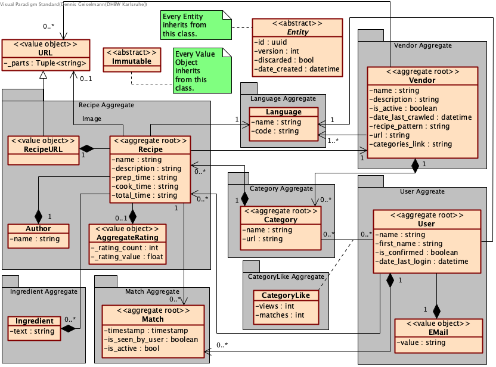

# SwipeFood

[](https://github.com/swipe-food/backend/actions/workflows/test_ci_pipeline.yml)
[](https://github.com/swipe-food/backend/actions/workflows/docker_build_and_deploy.yml)
[](https://codecov.io/gh/swipe-food/backend)

## Run

### Local

1. Run the Postgres (optional with pgAdmin)
```shell
docker-compose up postgres pgadmin
```

2. Create a `local.env` file with all necessary environmental variables. Have a look at the `example.local.env` file.

3. Run the API and/or the Crawler
```shell
python3 -m main.api
python3 -m main.crawler
```

### Docker Compose

1. Create a `dkc.env` file with all necessary environmental variables. Have a look at the `example.dkc.env` file. The only difference to the previous `example.local.env` file is that the host of the Postgres database is the `postgres` container itself.


2. Run the complete application (API, Crawler, Postgres DB, pgAdmin) 
```shell
docker-compose --env-file=dkc.env up 
```

## Domain Model



## Development

For dependency management pip is used in combination with [pip-tools](https://github.com/jazzband/pip-tools).

Install:
```shell
python3 -m pip install pip-tools
```

Add new dependencies to the ``requirements.in`` file and keep the `requirements.txt` file update with the `pip-compile` command. Sync your installed dependencies with the `pip-sync` command.

